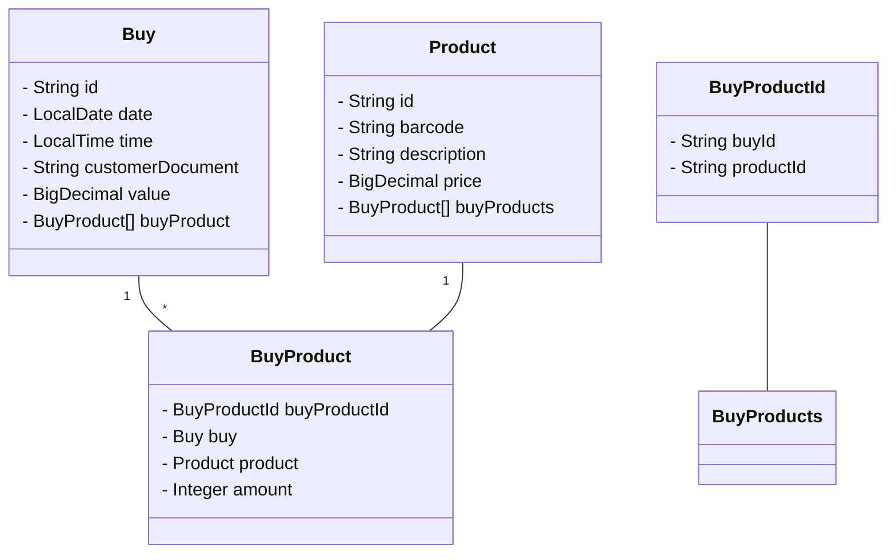

# Super Mercado

## Sobre

Sistema de automação de compras.

## Modelo

```mermaid
classDiagram
    class Buy {
        - String id
        - LocalDate date
        - LocalTime time
        - String customerDocument
        - BigDecimal value
        - BuyProduct[] buyProduct 
    }
    
    class Product {
        - String id
        - String barcode
        - String description
        - BigDecimal price
        - BuyProduct[] buyProducts 
    }
    
    class BuyProduct {
        - BuyProductId buyProductId 
        - Buy buy
        - Product product
        - Integer amount
    }
    
    class BuyProductId {
        - String buyId
        - String productId
    }
    
    Buy "1" -- "*" BuyProduct
    Product "1" -- "*" BuyProduct
    BuyProductId  -- BuyProducts 
```
